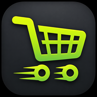
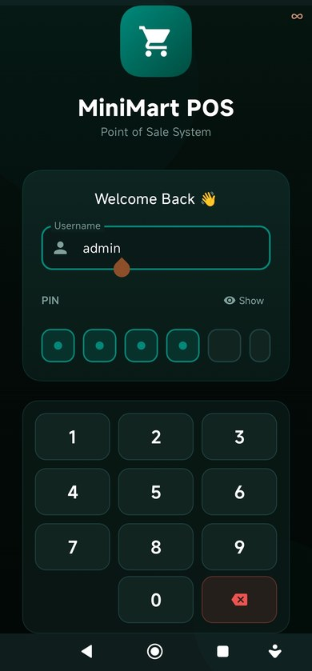
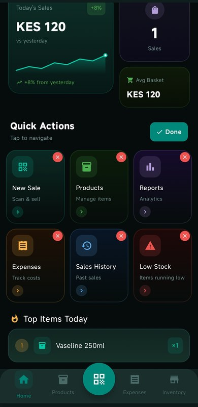
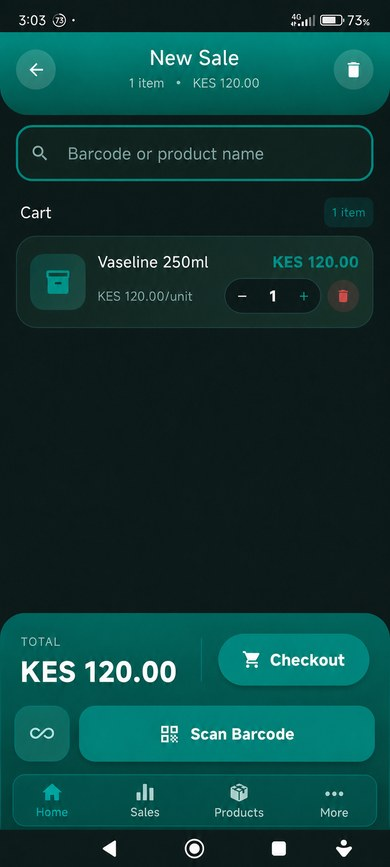
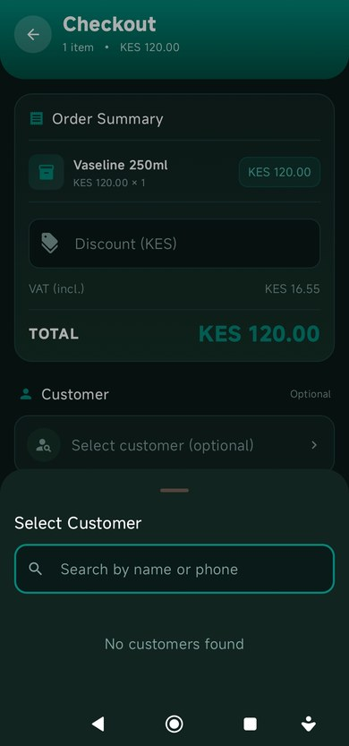
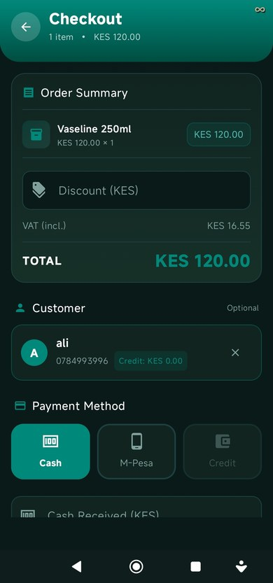
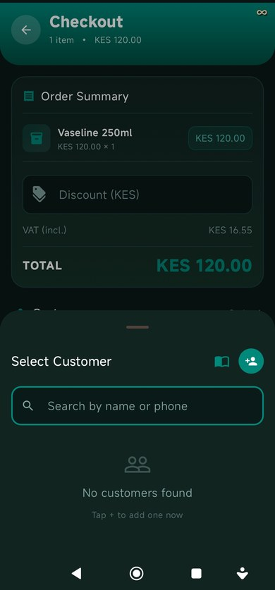

<div align="center">



# 🛒 MiniMart POS

**Fast · Offline · Secure Android Point-of-Sale for Kenyan mini-markets**

Built with Kotlin + Jetpack Compose · Designed for Mambrui & beyond 🇰🇪

[](https://github.com/Baker0o7/MiniMart-Pos/releases/latest)
[](https://github.com/Baker0o7/MiniMart-Pos/actions)
[](https://developer.android.com)
[](https://kotlinlang.org)

</div>

---

## 📱 Screenshots

| Login | Dashboard | New Sale |
|:-----:|:---------:|:--------:|
|  |  |  |

| Checkout | Credit Payment | Customer Search |
|:--------:|:-------------:|:---------------:|
|  |  |  |

---

## ✨ Features

### 🛍️ New Sale
- Camera barcode scanner (ML Kit — EAN-13, UPC, QR, Code-128, Code-39, Data Matrix)
- Bluetooth / USB HID barcode scanner (pairs as keyboard)
- **Weighing scale support (PLU)** — decodes variable-weight EAN-13 barcodes
  from supermarket scales; auto-calculates price from weight × price/kg
- **∞ Continuous scan mode** with animated laser overlay, corner brackets,
  green flash on every successful scan, and live scan counter
- Product search by name or barcode with live dropdown
- Cart with quantity stepper, per-item discounts
- **Inclusive VAT** — tax extracted from price, not added on top

### 💳 Checkout & Payments
- **Cash** — quick-amount buttons, animated change display
- **M-Pesa** — ref number field, amount-due box
- **Credit** — customer wallet or buy-on-account (negative balance allowed)
- **Split payment** — combine credit + cash in one transaction
- Customer selector with search + contacts import + quick-add form
- Auto-opens cash drawer on cash payment (configurable)
- Haptic feedback confirms every completed sale

### 👤 Customer Credit System
- Register customers: name, phone, email (with phone-contact import)
- **Credit wallet** — add deposits, deduct on purchases
- **Buy on account** — customers can take goods on credit even at KES 0 balance
- Full transaction history per customer
- **Credit Ledger** screen — every outstanding balance at a glance,
  expandable transaction history per customer

### 🌐 Multi-Device LAN Sync
- Turn any device into a sync server (no internet, no cloud — pure local WiFi)
- Lightweight HTTP server on port 9876 (`/ping`, `/changes`, `/apply`)
- Push local pending changes, pull remote changes, skip own-device echoes
- Per-entity sync log (Product, Sale, Customer, Expense, Credit Tx)
- Pending-changes badge + one-tap "Sync Now" in Settings

### 🗃️ Cash Drawer
- ESC/POS `ESC p` kick via thermal printer RJ11 port (auto-detected)
- Direct Bluetooth cash drawer (configure MAC in Settings)
- Auto-opens on cash payment (toggle) · Test button in Settings

### 📦 Inventory & Products
- Add/edit: price, cost, stock, category, SKU, unit, tax rate
- Supplier info + reorder quantity · Batch number + expiry date tracking
- Color-coded expiry urgency badges
- Low-stock background alerts (WorkManager, 12h interval)
- Expiry notifications 1–3 months ahead (configurable)
- Stock adjustments with reason log

### 📊 Reports & Analytics
- Today's revenue with mini line chart + % vs yesterday
- Transaction count, average basket, top-selling items
- Expense tracking (11 categories) + colour-coded P&L with progress bars
- Sales history with debounced search

### 👥 Role-Based Access Control

| Permission | Owner | Manager | Cashier |
|---|:---:|:---:|:---:|
| Process sales | ✅ | ✅ | ✅ |
| Apply discounts | ✅ | ✅ | ❌ |
| View reports | ✅ | ✅ | ❌ |
| Edit products | ✅ | ✅ | ❌ |
| Multi-device sync | ✅ | ✅ | ❌ |
| User management | ✅ | ❌ | ❌ |

Route-level guards bounce unauthorized users back automatically, even on
direct navigation/deeplink attempts.

### 🔐 Security
- **Argon2id PIN hashing** (t=3, m=64MB, p=4) — OWASP recommended,
  auto-upgrades legacy SHA-256 hashes on first login
- Biometric login (fingerprint/face) with safe FragmentActivity handling
- 6-digit PIN keypad with show/hide toggle + dedicated Enter key
- **3-strike lockout** — 30s countdown after 3 failed attempts
- **15-minute inactivity auto-logout**
- **Audit log** — timestamped record of logins, sales, credit changes,
  user management, and session expiry (auto-trimmed)

### 💾 Backup & Data
- One-tap backup to `Downloads/MiniMartPOS/backups/` · Restore from saved list
- Share backup via USB, cloud, WhatsApp
- 100% offline — Room SQLite, no internet required for core operation

### 🎨 UI / UX
- Deep dark teal theme — readable in bright retail lighting
- Consistent gradient top bar across all 17 screens
- Custom numeric keypad on login (✓ Enter + ⌫ Backspace)
- Animated scanner overlay: pulsing border, sweeping laser, corner brackets
- Dashboard stats with live line chart · pull-to-refresh
- Customizable quick action grid (hide/restore any card)
- Consistent green Save / red Delete / teal navigation button language

---

## 🏗️ Tech Stack

| Layer | Technology |
|---|---|
| Language | Kotlin 2.0 |
| UI | Jetpack Compose + Material 3 |
| Architecture | MVVM · Clean Architecture · Repository |
| DI | Hilt |
| Database | Room 2.6 (SQLite, v9) |
| PIN Security | Argon2id (argon2-kt 1.4.0) |
| Camera | CameraX + ML Kit Barcode |
| Sync | Custom HTTP server/client over local WiFi |
| Background | WorkManager |
| Preferences | DataStore + SharedPreferences |
| Printing | Bluetooth ESC/POS |
| Navigation | Navigation Compose |

---

## 🚀 Getting Started

```bash
git clone https://github.com/Baker0o7/MiniMart-Pos.git
cd MiniMart-Pos
./gradlew assembleDebug
```

**First-launch credentials**

| Field | Value |
|---|---|
| Username | `admin` |
| PIN | `1234` |

Seeded with 5 demo products. PIN auto-upgrades to Argon2id on first login.

---

## 📁 Project Structure

```
app/src/main/kotlin/com/minimart/pos/
├── data/
│   ├── dao/         ProductDao · SaleDao · UserDao · ExpenseDao
│   │                ShiftDao · CustomerDao · SyncDao
│   ├── db/          AppDatabase (v9) · DatabaseCallback (seed)
│   ├── entity/       Product · Sale · SaleItem · User · Expense
│   │                Shift · Customer · CreditTransaction · SyncLog
│   └── repository/  (one per entity + SettingsRepository)
├── di/              DatabaseModule
├── printer/         ThermalPrinter · CashDrawerManager
├── scanner/         MLKitScanner · KeyboardScanner · BluetoothScannerManager
├── sync/            SyncServer · SyncClient
├── ui/
│   ├── screen/      17 screens (Login → CreditOverview)
│   ├── viewmodel/   Per-screen ViewModels + SessionViewModel · SyncViewModel
│   ├── theme/       DT color tokens
│   └── NavGraph.kt  Routes + BottomNavBar + AccessGuard
├── util/            BackupManager · PdfReceiptGenerator · PinHasher
│                    RoleManager · SessionManager · AuditLogger · PluDecoder
└── worker/          LowStockWorker · ExpiryAlertWorker
```

---

## ⚙️ CI/CD Signing Secrets

```
SIGNING_KEY_ALIAS      = minimart
SIGNING_KEY_PASSWORD   = android
SIGNING_STORE_PASSWORD = android
```

---

<div align="center">

Built with ❤️ for Kenyan mini-markets 🇰🇪

[](https://github.com/Baker0o7/MiniMart-Pos/releases/latest)

</div>
