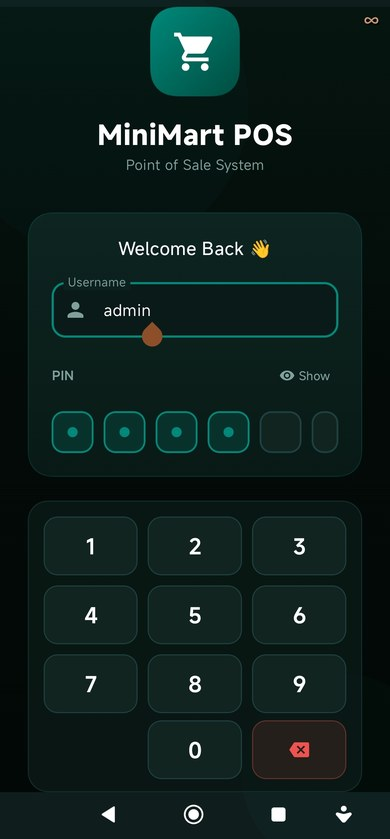
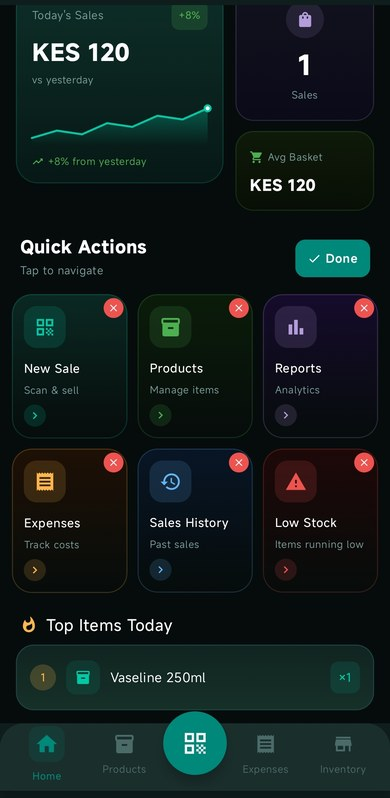
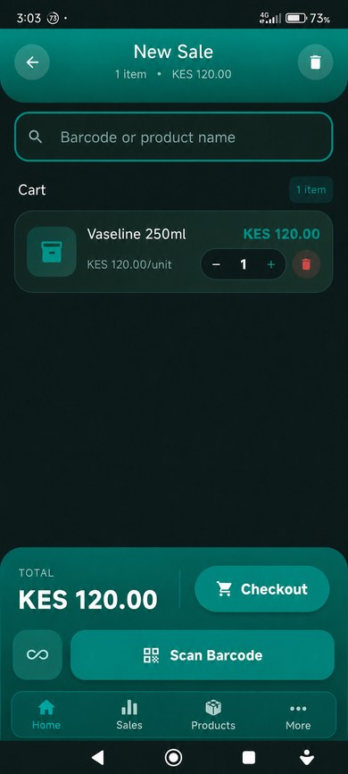
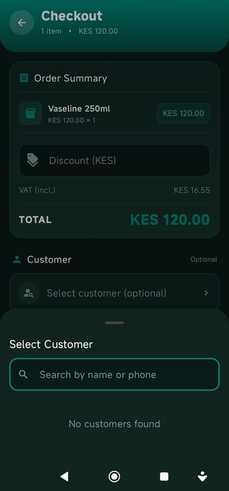
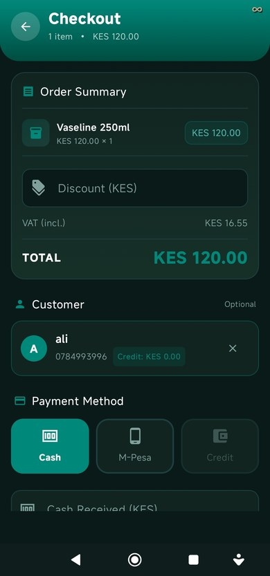
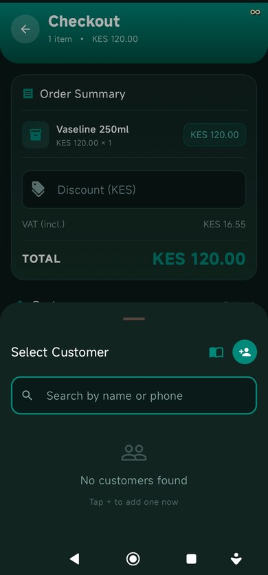

<div align="center">


# 🛒 MiniMart POS

**Fast · Offline · Secure Android Point-of-Sale for Kenyan mini-markets**

Built with Kotlin + Jetpack Compose 🇰🇪

[](https://github.com/Baker0o7/MiniMart-Pos/releases/latest)
[](https://github.com/Baker0o7/MiniMart-Pos/actions)
[](https://developer.android.com)
[](https://kotlinlang.org)
[](https://developer.android.com/jetpack/androidx/releases/room)
[](https://junit.org/junit4/)

</div>

---

## 📱 Screenshots

| Login | Dashboard | New Sale |
|:-----:|:---------:|:--------:|
|  |  |  |

| Checkout | Credit Payment | Customer Search |
|:--------:|:-------------:|:---------------:|
|  |  |  |

---

## ✨ Features

### 🛍️ New Sale
- Camera barcode scanner (ML Kit — EAN-13, UPC, QR, Code-128, Code-39, Data Matrix)
- Bluetooth / USB HID barcode scanner support
- **Weighing scale support (PLU)** — decodes variable-weight EAN-13 barcodes,
  auto-calculates price from weight × price/kg, weight persisted in sale records
  and correctly shown (not "×1") on both the in-app and shareable PDF receipt
- **Continuous scan mode** with animated laser overlay, corner brackets,
  green flash confirmation, and live scan counter badge
- Keyboard "Next" navigation flows through every field in the Add Product form
- Product search by name or barcode with live dropdown — results show stock, and out-of-stock items are flagged
- Cart with quantity stepper, **tap the quantity to type it** (e.g. 24 bottles), per-item discounts
- **Weighed items always ask for the weight** — scanning or tapping a PLU product opens a weight dialog
  with a live price, instead of silently adding one unit
- Inline success / error banner for scans and cart actions
- **Inclusive VAT** — tax extracted from price, not added on top
- **Cent-exact totals** — the checkout subtotal/discount/total math runs on an
  internal `Money` value class (Long cents) rather than raw `Double`, avoiding
  the floating-point rounding drift that repeated addition across many cart
  lines can otherwise produce
- **Cart badge** on bottom nav shows pending item count when navigating away
- Guarded against double-tap: rapid double-tapping "Complete Sale" can't create
  two sales from one transaction
- **Atomic sales** — the sale, stock deduction and any customer credit are one
  database transaction; a sale that can't be fully recorded (e.g. not enough
  stock) is rolled back instead of leaving a half-written record
- Confirmation before clearing the cart

### 💳 Checkout & Payments
- **Cash** — one-tap "Exact" plus quick-amount buttons, real change calculation; money fields only accept digits and one decimal point
- **M-Pesa** — ref number field
- **Credit** — customer wallet or buy-on-account (negative balance allowed)
- **M-Pesa STK push (Daraja)** — amounts are rounded up to whole shillings and
  payment status is confirmed by polling; network calls run off the main thread, and the
  sale can't be completed while a prompt is still pending (no double charge)
- **Split payment** — combine credit + cash in one transaction (credit is capped
  at the balance and sale total; change is never counted as till cash), with proper
  error feedback if it fails (shown as an on-screen banner, not silently dropped)
- Customer selector with search + contacts import — debtors (customers who
  owe money) are clearly flagged in red, not shown the same as a zero balance;
  "Save & Select" adds a new customer and selects them in one step (an existing
  phone number reuses that customer instead of creating a duplicate)
- Cash drawer auto-opens on cash payment (configurable)
- Haptic feedback confirms every completed sale
- All money displays respect the app's configurable currency setting
  (no screen is hardcoded to "KES")

### 👤 Customer Credit System
- Register customers with name, phone, email
- **Credit wallet** — deposits, deductions on purchases
- **Buy on account** — negative balance allowed
- Full transaction history per customer
- Deleting a customer asks for confirmation (it also deletes their credit history)
- Refunding or voiding a credit sale automatically returns the credit used
- **Credit Ledger** — all non-zero balances at a glance
  - 🔴 Debtors (negative, owe money) shown first with "OWES [currency] X" in red
  - 🟢 Wallet balances shown in green
  - Two summary stats: "Owed to Shop" + "Wallet Credit"

### 🌐 Multi-Device LAN Sync
- No internet, no cloud — pure local WiFi sync
- **Pairing code authentication** — 6-digit code shown on server device,
  required on client device, compared in constant time (not vulnerable to a
  timing side-channel), and **rate-limited** (5 failed attempts locks out
  further guesses for 30s — a 1,000,000-combination code can't be brute-forced
  at LAN speed)
- **Pairing secrets encrypted at rest** — both this device's own code and any
  remembered peer code are stored via Android Keystore-backed
  EncryptedSharedPreferences, not plaintext
- **Duplicate-safe** — retrying a sync (dropped connection, double-tapping
  "Sync Now") can't apply the same remote change twice
- Server device: toggle "Act as Sync Server", share the displayed code
- Client device: enter server IP + pairing code → Sync Now

### 🗃️ Cash Drawer
- ESC/POS kick via thermal printer RJ11 port
- Direct Bluetooth cash drawer support
- Auto-opens on cash payment (toggle) · Test button in Settings

### 📦 Inventory & Products
- Filter chips by category plus **Low stock**; colour-coded stock pills (in stock / low / out)
- Tap a product to edit it (cashiers get a read-only view); the add/edit form covers price, cost, stock,
  category chips, SKU, unit, VAT %, low-stock threshold, PLU, expiry date picker and a live margin hint
- Supplier info + reorder quantity · Batch number + expiry date
- Color-coded expiry urgency badges · Low-stock background alerts (WorkManager)
- Stock adjustments with reason log
- **PLU / Weighing scale toggle** per product (PLU code + price/kg)
- **Weighed products are stocked in kilograms** — sales deduct the actual weight,
  refunds/voids put it back, and the stock field is entered and shown in kg
- Duplicate barcodes **and duplicate PLU codes** are rejected with a clear message instead of overwriting
  another product; save/adjust errors are shown on screen
- Negative price/stock can't be saved (validated at both the UI and repository layer)

### 📊 Reports & Analytics
- Revenue vs yesterday (real % comparison, flips red when down)
- Dashboard auto-refreshes at midnight — "today" always means today
- Transaction count, average basket, top-selling items
- **Custom date range** — the "Custom" chip in Reports and Expenses opens a date-range picker
- **Reports & Expenses** use proper calendar week (Mon–Sun) and calendar month,
  not rolling 7/30-day windows
- **Expenses** are grouped by day (Today / Yesterday / date) with daily totals, show each category's share
  of spend on the P&L tab, and can be logged for today or yesterday; the signed-in user is recorded on each one
- Sales History: color-coded payment method chips (💵 Cash / 📱 M-Pesa / 🤝 Credit / 🔀 Split)
- **Share a business report as a PDF via WhatsApp** — the green share button on Reports builds an A4 report
  for the selected period (today / week / month / custom range): revenue, sales count, average basket,
  discounts, VAT, refunds/voids, sales by payment method, top sellers, expenses by category and net (sales − expenses),
  and opens WhatsApp with the PDF attached (falls back to the share sheet if WhatsApp isn't installed) — ideal for
  end-of-day reports to an accountant or partner
- **Quick Void** on COMPLETED sales from the history list (Manager+)
- **Refund / Void** from the receipt screen is limited to Owner and Manager; each
  can only be applied once, restores stock and returns any credit used

### 👥 Role-Based Access Control

| Permission | Owner | Manager | Cashier |
|---|:---:|:---:|:---:|
| Process sales | ✅ | ✅ | ✅ |
| Apply discounts | ✅ | ✅ | ❌ |
| View reports | ✅ | ✅ | ❌ |
| Edit products | ✅ | ✅ | ❌ |
| Void sales | ✅ | ✅ | ❌ |
| Multi-device sync | ✅ | ✅ | ❌ |
| User management | ✅ | ❌ | ❌ |

Every route above is enforced by a route-level `AccessGuard` that bounces
unauthorized users, even on direct navigation. Cannot remove the last active
Owner account (permanent lockout protection).

### 🔐 Security
- **Argon2id PIN hashing** (t=3, m=64MB, p=4), auto-upgrades legacy SHA-256 on
  login, constant-time comparison on both paths; hashing runs off the main thread
  and new users always get Argon2id
- **Default PIN must be changed** — signing in with the factory `1234` PIN shows a
  non-dismissable "Set a new PIN" dialog
- **Biometric login** — bound to one explicitly opted-in user per device
  (Settings → Account). Any fingerprint on the device cannot authenticate as
  an arbitrary username.
- **Persisted 3-strike lockout** — survives force-close, task-kill, and device
  reboot
- **15-minute inactivity auto-logout** — any touch or scanner key resets the timer, and the
  timeout returns to the PIN screen (it used to sign out in state only)
- **Persistent, thread-safe audit log** at `files/audit.log` covering logins,
  logouts, biometric sign-ins, completed sales, discounts, credit usage, and user
  creation / removal / PIN resets
- **Sync pairing secrets** — rate-limited, constant-time compared, and
  encrypted at rest (see Multi-Device Sync above)
- **At-rest database protection**: relies on Android's File-Based Encryption
  (FBE), hardware-backed and enabled by default since Android 7.0. App-level
  SQLCipher encryption was evaluated twice and reverted both times due to
  native-library crashes on startup; FBE was judged the safer,
  zero-maintenance choice for this app.

### 💾 Backup & Data
- One-tap backup to the app's own storage (`Android/data/com.minimart.pos/files/backups/`) —
  no all-files permission required. Use **Share Latest Backup** to copy it off the
  device (app storage is cleared on uninstall). Older backups in
  `Downloads/MiniMartPOS/backups/` still appear in the restore list
- **Optional passphrase encryption** — set a passphrase when backing up and the file is saved as an
  encrypted `.mmbak` (AES-256-GCM, PBKDF2 key), unreadable without it, so it's safe to share or upload;
  it restores on any phone. Wrong passphrases and tampered files are rejected. (A lost passphrase can't be recovered.)
- Restores are validated first (SQLite header, schema version) and a safety copy of the
  current data is kept
- **Restore requires explicit two-step confirmation** — selecting a backup
  shows exactly what will be lost before anything is overwritten, then the
  app automatically restarts (WAL/SHM files handled correctly)
- 100% offline — Room SQLite v13, no internet required for core operation

### 🎨 UI / UX
- Deep dark teal theme — readable in bright retail lighting; status-bar and navigation icons
  stay light whichever Dark-mode setting is chosen
- Low-stock and expiry alerts ask for notification permission (Android 13+) and open Inventory when tapped,
  after sign-in, without discarding an open cart
- Dashboard header shows the signed-in role (Owner / Manager / Cashier) and store name
- Emerald "glass" login screen with a 6-box PIN field, large keypad and haptic key presses
- System-bar insets handled once, so nothing hides behind the navigation bar
- Consistent gradient top bar across all screens
- Press-scale animation on dashboard action cards
- Color-coded payment method chips throughout
- Consistent destructive-action dialogs app-wide (styled red confirm +
  bordered cancel, clear "cannot be undone" copy)
- Animated scanner overlay: pulsing border, sweeping laser, corner brackets
- Pull-to-refresh on dashboard (updates today + yesterday revenue)

---

## 🧪 Testing

Local JVM unit tests (`app/src/test`) cover the core financial calculation
logic — no emulator needed:

```bash
./gradlew test
```

| Test file | Covers |
|---|---|
| `MoneyTest` | Cent-exact arithmetic, the classic `0.1 + 0.2 != 0.3` Double failure case, rounding, clamping |
| `CartUiStateTest` | Checkout subtotal/discount/total math, the discount-floor regression, weighed-item pricing |
| `CartDiscountTest` | Discount capping: oversized/stale/negative global and line discounts never give goods away |
| `PluDecoderTest` | Weighing-scale barcode decode/reject cases, price calculation |

---

## 🏗️ Tech Stack

| Layer | Technology |
|---|---|
| Language | Kotlin 2.0 |
| UI | Jetpack Compose + Material 3 |
| Architecture | MVVM · Clean Architecture · Repository |
| DI | Hilt |
| Database | Room 2.6 (SQLite v13), Android FBE at rest |
| Money | Custom `Money` value class (Long cents) for checkout-critical math |
| PIN Security | Argon2id (argon2-kt 1.4.0) |
| Sensitive Storage | Jetpack Security (`EncryptedSharedPreferences`, Keystore-backed) |
| Camera | CameraX + ML Kit Barcode |
| Sync | Custom HTTP server/client over LAN WiFi, pairing-code authenticated |
| Background | WorkManager (low-stock + expiry alerts) |
| Preferences | DataStore + SharedPreferences |
| Printing | Bluetooth ESC/POS |
| Navigation | Navigation Compose |
| State | `SavedStateHandle` for process-death recovery |
| Paging | Paging 3 (Sales History loads 30 rows at a time, totals computed in SQL) |
| Architecture layers | ViewModel → use case (`domain/usecase`) → repository → DAO |
| Testing | JUnit4 (local unit tests) · GitHub Actions runs them on every push/PR and gates releases |

---

## 🚀 Getting Started

```bash
git clone https://github.com/Baker0o7/MiniMart-Pos.git
cd MiniMart-Pos
./gradlew assembleDebug
```

**First-launch credentials**

| Field | Value |
|---|---|
| Username | `admin` |
| PIN | `1234` (you'll be asked to change it on first sign-in) |

---

## 📁 Project Structure

Gradle modules: **`:app`** (UI, DI wiring, sync, printer, M-Pesa) · **`:data`** (Room database,
DAOs, entities, repositories) · **`:core`** (Money, PluDecoder, PinHasher, UiResult).

```
data/src/main/kotlin/com/minimart/pos/                 ← :data module
├── data/
│   ├── dao/          ProductDao · SaleDao · UserDao · ExpenseDao
│   │                 ShiftDao · CustomerDao · SyncDao
│   ├── db/           AppDatabase (v13) · DatabaseCallback (seed)
│   │                 AppMigrations (v8→…→v13)
│   ├── entity/       Product · Sale · SaleItem · User · Expense
│   │                 Shift · Customer · CreditTransaction · SyncLog
│   └── repository/   (one per entity + SettingsRepository)

core/src/main/kotlin/com/minimart/pos/                 ← :core module
├── util/             Money · PluDecoder · PinHasher · UiResult
└── di/               SecurePrefs qualifier

app/src/main/kotlin/com/minimart/pos/                  ← :app module
├── di/               DatabaseModule
├── domain/usecase/   CompleteSaleUseCase · RefundSaleUseCase · VoidSaleUseCase
├── printer/          ThermalPrinter · CashDrawerManager
├── scanner/          MLKitScanner · KeyboardScanner · BluetoothScannerManager
├── sync/             SyncServer · SyncClient
├── ui/
│   ├── screen/       17 screens (Login → CreditOverview) + shared DateRangeDialog
│   ├── viewmodel/    Per-screen ViewModels + SessionViewModel · SyncViewModel
│   ├── theme/        DT color tokens
│   └── NavGraph.kt   Routes + BottomNavBar (cart badge) + AccessGuard
├── util/             BackupManager · PdfReceiptGenerator · RoleManager
│                     SessionManager · AuditLogger · Extensions
└── worker/           LowStockWorker · ExpiryAlertWorker

app/src/test/kotlin/com/minimart/pos/
├── util/             MoneyTest · PluDecoderTest
└── ui/viewmodel/     CartUiStateTest
```

---

## 🚢 Releases

Releases are built by the **Build & Release** GitHub Actions workflow (run it from the
Actions tab, or push a `v*` tag). The version comes from `versionName` in
`app/build.gradle.kts`; the workflow publishes a signed APK and AAB to GitHub Releases.

---

## ⚙️ CI/CD Signing Secrets

```
SIGNING_KEY_ALIAS      = minimart
SIGNING_KEY_PASSWORD   = android
SIGNING_STORE_PASSWORD = android
```

---

<div align="center">

Built with ❤️ for Kenyan mini-markets 🇰🇪

[](https://github.com/Baker0o7/MiniMart-Pos/releases/latest)

</div>
